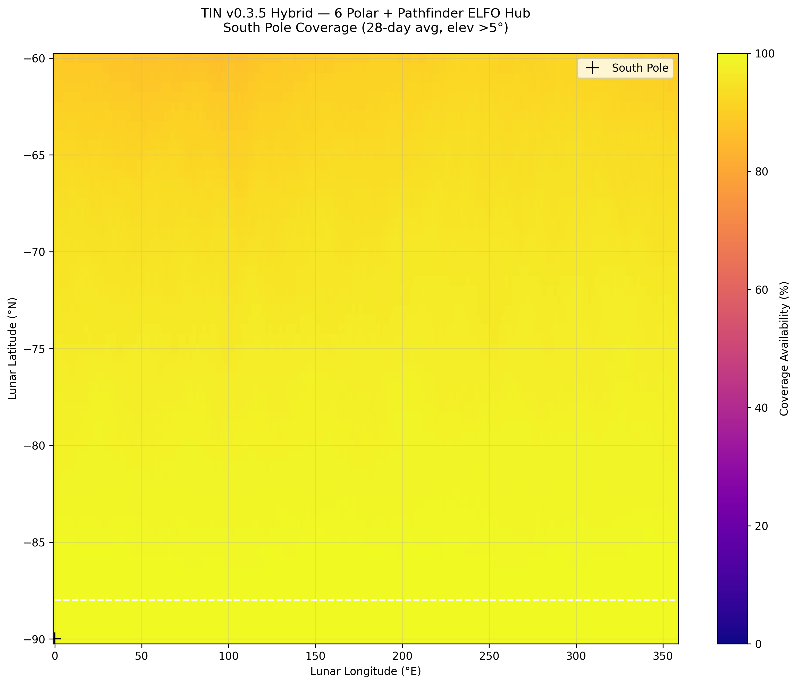
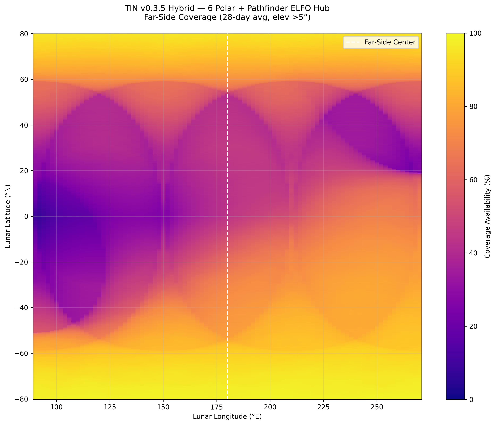
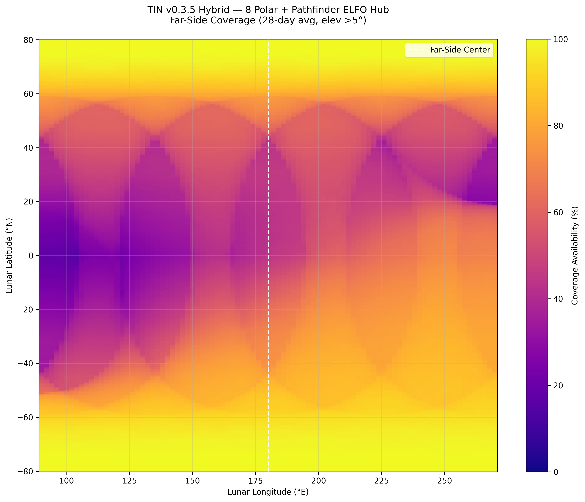

# Tolerant Interlunar Network (TIN)

**v0.3.6** — 19 February 2026

Hybrid Polar + Lunar Pathfinder ELFO architecture for persistent South Pole and far-side lunar coverage using DTN + AI routing. Lunar demonstrator for a generalizable solar-system tolerant network.

**Author:** Joe Councilman (tc), Independent Researcher, San Jose, CA
**Contact:** toxic2040@yahoo.com
**LSIC Member — Crosscutting Capabilities Focus Group**

---

### Heritage & Foundations
TIN builds directly on the Interplanetary Internet (IPN) and Delay-Tolerant Networking (DTN) research originated at NASA JPL in 1998–2003 by Vint Cerf, Scott Burleigh, and team — explicitly designed to solve Earth-Sun conjunction radio blackouts and long/variable delays. It also draws strategic inspiration from Lynn D. Harper's foundational NASA Ames work on low-cost lunar settlement and sustained surface operations.

### Current Baseline (locked)
- 6–8 smallsats in 400 km circular 90° polar orbits
- Primary DTN/AI hub: real Lunar Pathfinder ELFO (frozen elliptical, perilune over South Pole)
- 28-day simulation results (elev >5°): South Pole 99.9–100.0 %, Far Side 63.2–68.5 %

### Hybrid Coverage Results (28-day avg, elev >5°)

| Configuration | South Pole (%) | Far-Side (%) |
|---|---|---|
| Pure Polar 6 sats @ 400 km | 99.6 | 46.4 |
| Pure Polar 8 sats @ 400 km | 100.0 | 54.4 |
| **Hybrid 6 polar + Pathfinder** | **99.9** | **63.2** |
| **Hybrid 8 polar + Pathfinder** | **100.0** | **68.5** |

**Download full table:** [Quick_Summary_Table_tin_hybrid_polar.csv](Quick_Summary_Table_tin_hybrid_polar.csv)

### Coverage Maps (28-day avg, elev >5°)

**South Pole — Hybrid 6 Polar + ELFO**


**Far-Side — Hybrid 6 Polar + ELFO**


**Far-Side — Hybrid 8 Polar + ELFO**


### Repository Contents

```
README.md                          — This file
TIN_TechMemo_v0.3.6.pdf           — Technical Memo (5-page, results + maps)
TIN_Lunar_Whitepaper_v0.3.6.md    — Lunar Technical Whitepaper (9-page)
TIN_Mars_Whitepaper_v0.3.6.md     — Mars Generalization Whitepaper (5-page)
TIN_Helio_Whitepaper_v0.3.6.md    — Solar-System Vision Whitepaper (6-page)
TIN_LSIC_LOI_v0.3.6.md            — LSIC Letter of Intent
PitchDeck_Outline_v0.3.6.md       — 10-slide pitch deck outline
tin_coverage_map.py                — Simulation CLI tool
Quick_Summary_Table_tin_hybrid_polar.csv — Full results table
tin_hybrid_*.png                   — Coverage maps
tin_400km_*.png                    — Pure polar coverage maps
archive/                           — Previous version files
```

### Try It Yourself

```bash
python tin_coverage_map.py --polar_sats 8 --region farside --include_elfo --output my_map.png
```

### References

1. Cerf, V. et al., "Delay-Tolerant Networking Architecture," RFC 4838, Apr 2007.
2. Fall, K., "A Delay-Tolerant Network Architecture for Challenged Internets," SIGCOMM 2003.
3. Bhasin et al., NASA SCaN Lunar Relay Studies, 2006–2008.
4. Harper, L.D. et al., "Life Support for a Low-Cost Lunar Settlement," New Space, 2016.
5. Lunar Pathfinder mission documentation (ESA/SSTL, 2026).

### License

Open-source. Released for the benefit of the lunar and interplanetary communications community.

---

*TIN is an independent research project. Not affiliated with NASA, ESA, or JHU/APL.*
*LSIC membership does not imply endorsement.*
